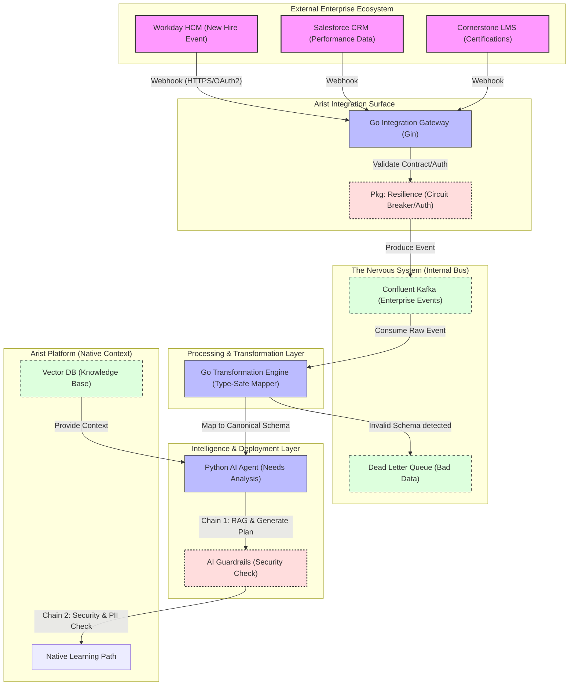

# Enterprise AI "Nervous System": HCM & LMS Integration PoC

### **The Narrative**
> "I recently wrapped up several major architectural POCs focused on agentic data systems. This repository demonstrates my approach to a **real-world AI deployment**: bridging the gap between static Enterprise HCM/LMS data and dynamic, AI-driven learning paths. I don't believe in bespoke, one-off integrations; I build 'Integration Surfaces' that are scalable, resilient, and secure." — **Alf**

---

## **1. The Architecture (The "How")**
This PoC uses a decoupled, event-driven architecture designed to move at the speed of an AI startup while respecting the stability requirements of a Fortune 500 enterprise.

* **Ingestion Gateway (Go/Gin):** High-concurrency "Front Door" for Workday/Salesforce webhooks.
* **Transformation Engine (Go):** Type-safe schema mapping (HCM $\rightarrow$ Arist Canonical).
* **AI Deployment Agent (Python):** RAG-based needs analysis with a dual-prompt "Guardrail" system.
* **Resilience Layer (Custom Pkg):** Native Circuit Breakers and Dead Letter Queue (DLQ) logic.

## 🏗 Architecture
---


---

## **2. The "Grit": Hardening for Production**
In complex enterprise deployments, things break. This PoC includes specific patterns to handle the "Grit":

* **Schema Drift Protection:** The Go Transformation layer enforces strict contracts. If an HCM field type changes, the record is routed to a **Dead Letter Queue (DLQ)** instead of crashing the pipeline.
* **Circuit Breakers:** To protect downstream AI APIs (OpenAI/Vertex AI), the `pkg/resilience` logic triggers an immediate "Open" state if failure thresholds are met, preventing cascading failures and API rate-limiting (429 errors).
* **AI Guardrails:** A secondary LLM pass validates all "Needs Analysis" outputs to prevent PII leakage and ensure compliance before any automated deployment.

---

## **3. Repository Structure**
```text
├── api/openapi/             <-- Documented "Integration Surface" for CIOs
├── services/
│   ├── integration-gateway/ <-- Go: Webhook Ingestion & Auth
│   ├── transformation/      <-- Go: Schema Mapping Logic
│   └── ai-deployment-agent/ <-- Python: Needs Analysis & Guardrails
├── pkg/
│   ├── resilience/          <-- Circuit Breaker & Retry Logic
│   └── schema-registry/     <-- Contract Enforcement
└── terraform/               <-- IaC Blueprints (GCP/Confluent/Cloud Run)
```

---
4. Infrastructure Blueprint (IaC)
While this PoC focuses on the logic layer, the production deployment is designed for Google Cloud (GCP) and Confluent Cloud:

Compute: Cloud Run for the Gateway and AI Agent (Serverless Scalability).

Messaging: Confluent Kafka (The "Nervous System" Backbone).

Security: Secret Manager for OAuth2 rotation and IAM for least-privilege access.


5. How to Run
Step 1: Start the Gateway

```bash 
cd services/integration-gateway
go run main.go

```

Step 2: Trigger an Event

```bash

curl -X POST http://localhost:8080/v1/ingest \
  -H "X-Integration-Key: alf-secret-poc-key" \
  -H "Content-Type: application/json" \
  -d '{
    "source": "Workday",
    "event_id": "NEW_HIRE_101",
    "payload": {"email": "cheetah@golf.com", "dept": "Engineering"}
  }'
  
%% Apply High-Visibility Styling
    classDef external fill:#f9f,stroke:#333,stroke-width:2px,color:#000;
    classDef internal fill:#1c2128,stroke:#58a6ff,stroke-width:1px,color:#fff;
    classDef persistence fill:#0d1117,stroke:#3fb950,stroke-width:1px,stroke-dasharray: 5 5,color:#fff;
    classDef resilience fill:#440505,stroke:#f85149,stroke-width:2px,stroke-dasharray: 3 3,color:#fff;

    class WD,SF,LMS external;
    class GW,TE,AI internal;
    class KF,DLQ,DB persistence;
    class Res,GR resilience;

    %% FORCE CSS OVERRIDE (The "Hammer")
    style WD color:#000
    style SF color:#000
    style LMS color:#000
    style GW color:#fff
    style Res color:#fff
    style KF color:#fff
    style DLQ color:#fff
    style TE color:#fff
    style AI color:#fff
    style GR color:#fff
    style LP color:#fff
    style DB color:#fff

```
Step 3: Run AI Analysis

```bash
cd services/ai-deployment-agent
python3 main.py

```

6. Future Roadmap

[ ] Integration with Workato for low-code connector expansion.

[ ] Real-time dashboard for "Integration Health" using Prometheus/Grafana.

[ ] Automated "Needs Analysis" fine-tuning based on employee feedback loops.

